# EOS Toolbox

This project is to utilize Eos easily.

## Dashboard

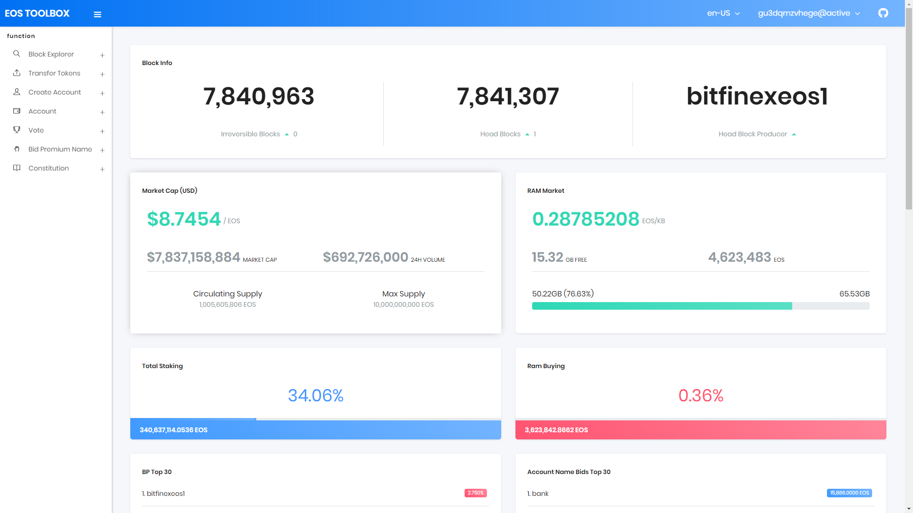

- Irreversible Blocks
- Head Blocks
- Head Block Producer
- Market Cap (USD)
- RAM Market
- Total Staking
- Ram Buying
- BP Top 30
- Account Name Bids Top 30

## Block Explorer

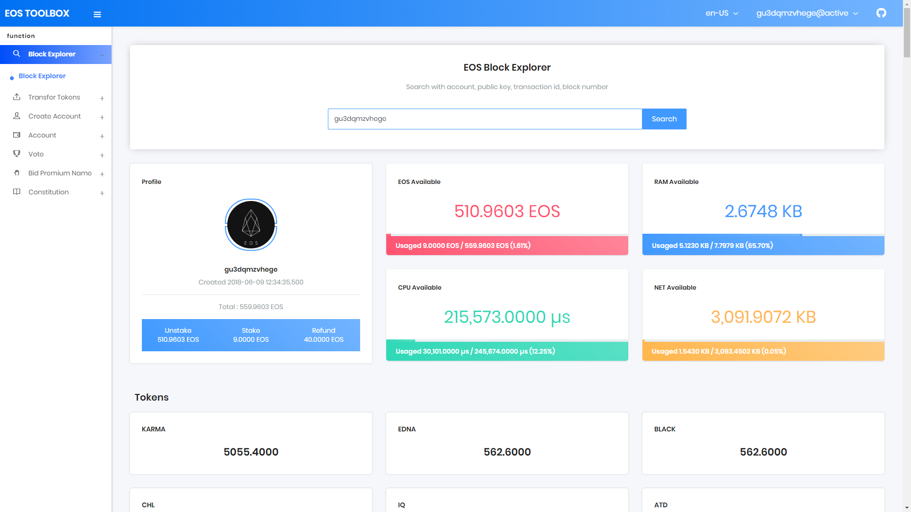
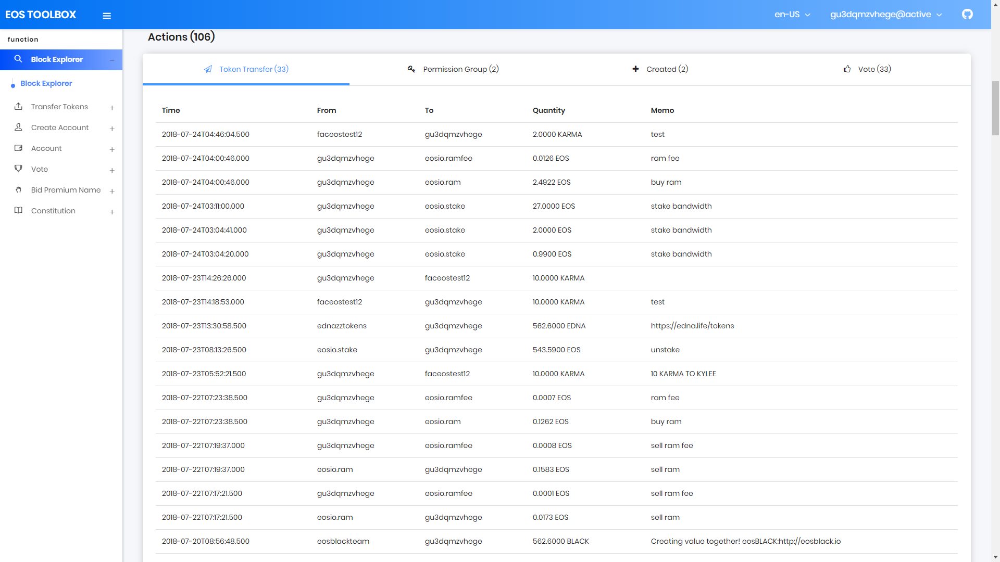

- Profile
- EOS Available
- RAM Available
- CPU Available
- NET Available
- Tokens
- Token Transfer
- Permission Group
- Created
- Vote

## Transfer Token

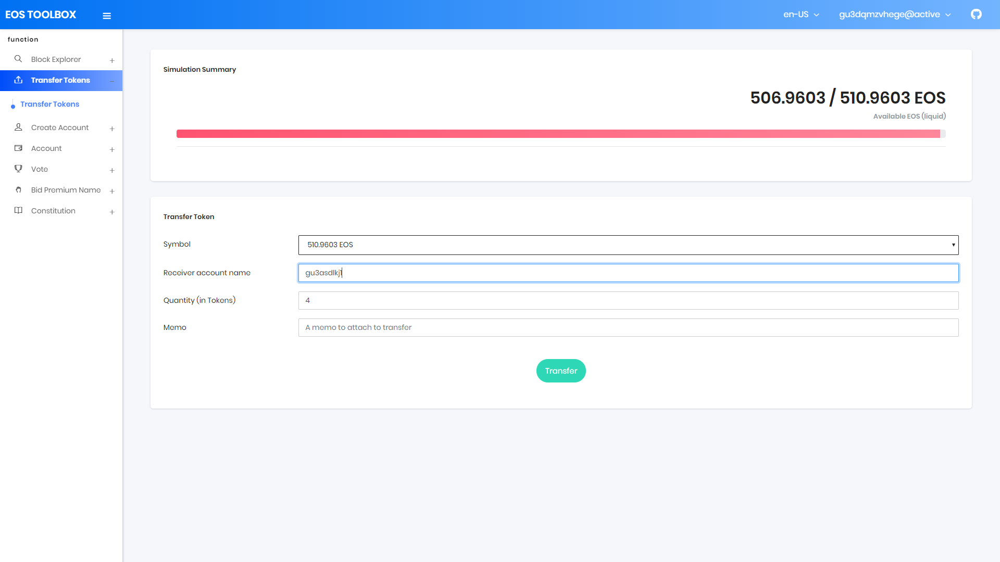

- Transfer Token Simulation

## Generate Key

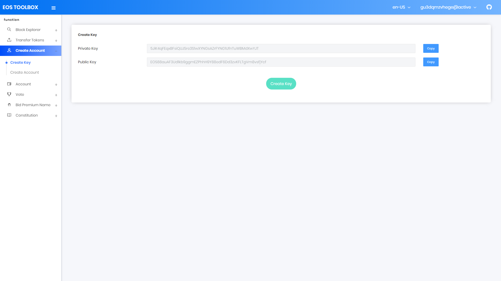

- Generate Unique Key pair

## Create Account

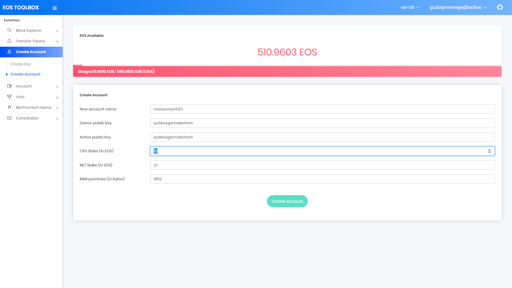

- Create account with key pair, staking some resources(cpu, net, ram)

## My Account

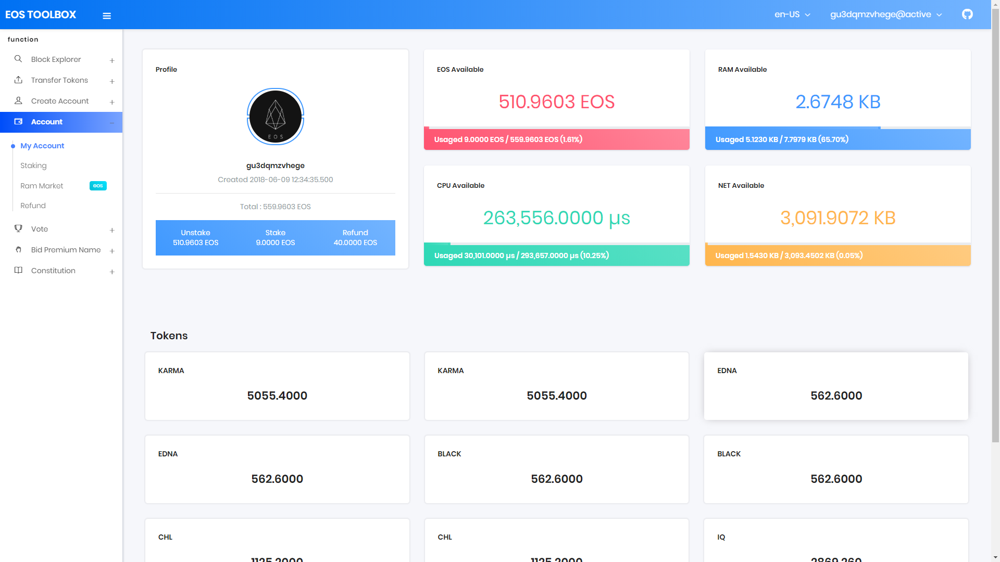

- My Profile
- EOS Available
- RAM Available
- CPU Available
- NET Available
- Tokens

## Staking

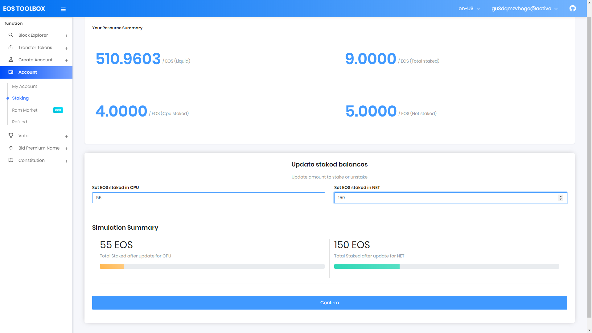

- Staking, Unstaking Simulation

## Ram Market

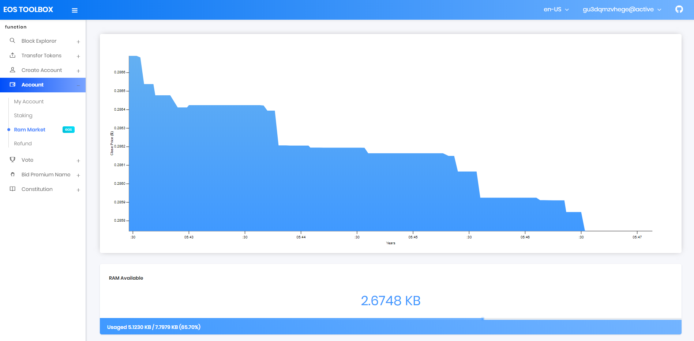
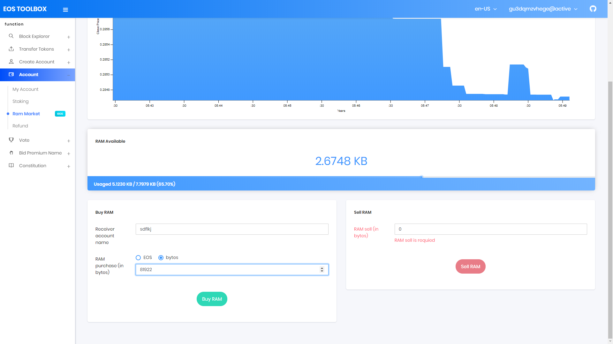

- Realtime Ram market price chart
- RAM available
- Buy or Sell RAM

## Refund

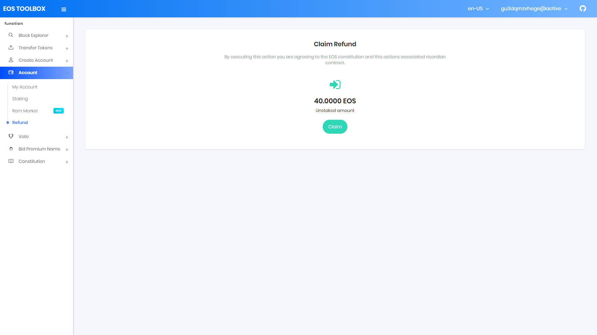

- Claim refund

## Vote

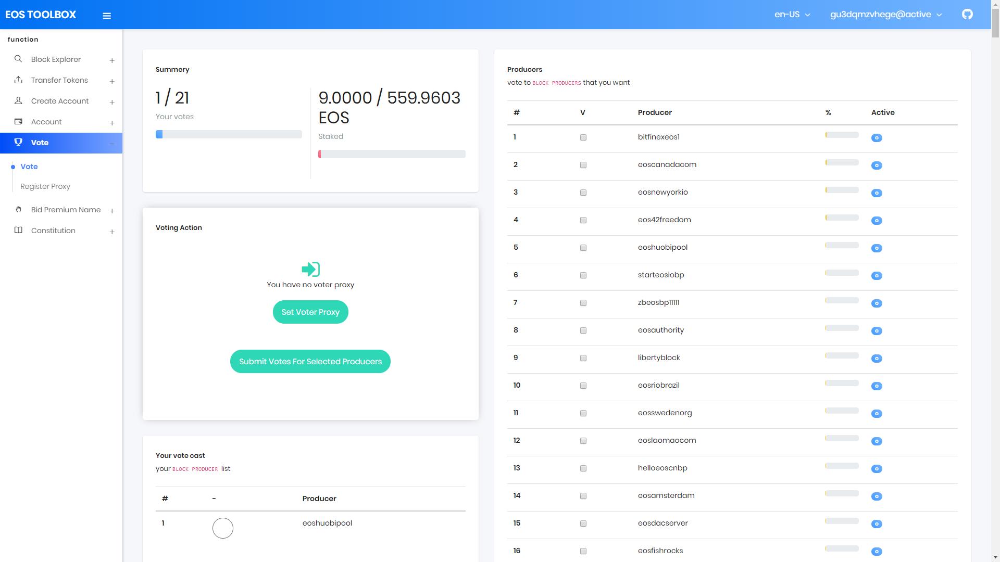

- My Votes
- My Staked
- Set Voter Proxy
- Submit Votes for selected producers
- My Votes cast
- Producers

## Voter Proxy

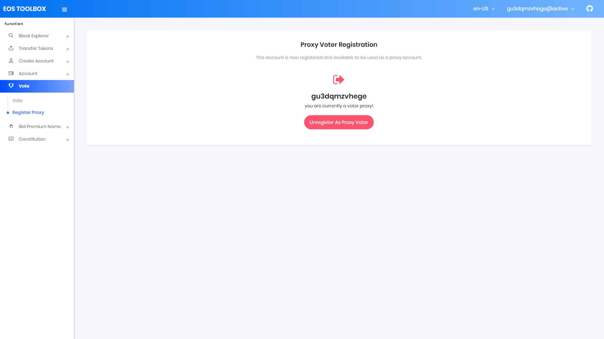

- Register Voter Proxy

## Constitution


- EOS Constitution

## Required

- npm or yarn

## Install dependencies

```
$ npm install or yarn install
```

## Starts the development server.

```
$ npm start or yarn start
```

## Bundles the app into static files for production.

```
$ npm run build or yarn build
```

# Todo

## Dashboard

```
- [o] Irreversible Block
- [o] Current Block
- [o] Last Block Producer
- [o] Supply Summary
- [o] Ram Market Summary
- [o] Total Stake
- [o] Total Votes
- [o] Ram Stake
- [o] Cpu, Net Stake
- [o] BP Top 30
- [o] Account Auction Top 30
```

## Block Explorer

```
- [o] Search by account
- [o] Search by pubkey
- [o] Search by transaction id
- [o] Search by block id
- [o] Account token balance
```

## Account

```
- [o] Create Account
- [o] Staking, Unstaking
- [o] Realtime RAM chart
- [o] Buy Ram
- [o] Sell Ram
- [o] Refund
```

## Vote

```
- [o] Producer List
- [o] Submit votes
- [o] Become Proxy
- [o] Set Proxy
```

## Coding convention

- VS Code [Prettierr Plugin](https://github.com/prettier/prettier-vscode)
- VS Code Prettier config (Ctrl + ,)

```
  "editor.formatOnSave": true,
  "prettier.semi": false,
  "prettier.printWidth": 100,
  "prettier.singleQuote": true,
  "javascript.format.enable": false,
  "prettier.eslintIntegration": true
```
